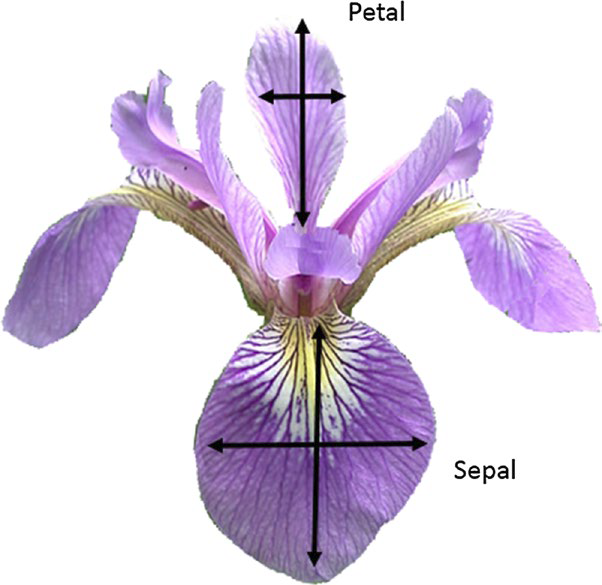

# 🌸 Multi-Class Classification on the Iris Dataset

This project demonstrates a basic multi-class classification problem using the famous Iris dataset. The task is to classify iris flowers into one of three species based on sepal and petal measurements.

---

## 📊 Dataset

The **Iris dataset** consists of 150 samples with 4 features:

- Sepal length (cm)
- Sepal width (cm)
- Petal length (cm)
- Petal width (cm)

The target labels are:
- `0`: Setosa
- `1`: Versicolor
- `2`: Virginica



---

## 🛠️ Tech Stack with Logos

| Tool/Library | Logo |
|--------------|------|
| Python       |  |
| Pandas       |  |
| NumPy        |  |
| Matplotlib   |  |
| Seaborn      |  |
| Scikit-learn |  |

---

## 📦 Libraries Used

```python
import pandas as pd
import numpy as np
import matplotlib.pyplot as plt
import seaborn as sns
from sklearn.model_selection import train_test_split
from sklearn.linear_model import LogisticRegression
from sklearn.metrics import classification_report, accuracy_score
